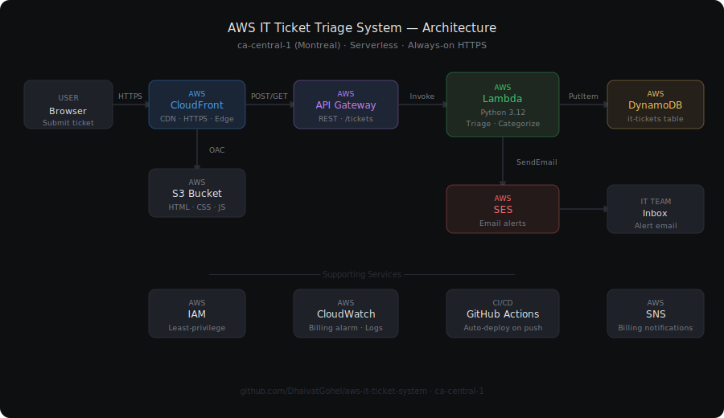

# AWS IT Ticket Triage System

A fully serverless IT support ticketing system built on AWS. Employees submit tickets via a web form — the system automatically categorizes and prioritizes them using keyword analysis, stores them in DynamoDB, sends email alerts to the IT team via SES, and displays a live admin dashboard.

**Live URLs:**
- Ticket form: https://d23mh63awvqncl.cloudfront.net
- Admin dashboard: https://d23mh63awvqncl.cloudfront.net/dashboard.html

---

## Architecture



---

## How it works

1. Employee fills out the ticket form and clicks Submit
2. Browser sends a POST request to the API Gateway endpoint
3. API Gateway triggers the Lambda function (Python 3.12)
4. Lambda scans the description for keywords and assigns a category (Hardware / Software / Network / Access / Security / General) and priority (Critical / High / Medium / Low)
5. Ticket is saved to DynamoDB with a unique UUID, timestamp, and status
6. Lambda calls SES to send an email alert to the IT team
7. Admin dashboard fetches all tickets via GET request and displays them with filters and stat cards

---

## Tech stack

| Layer | Service | Purpose |
|---|---|---|
| Frontend | S3 + CloudFront | Static hosting with HTTPS and global CDN |
| API | API Gateway | Public HTTPS REST endpoint |
| Backend | Lambda (Python 3.12) | Triage logic, DynamoDB writes, SES calls |
| Database | DynamoDB | Serverless NoSQL ticket storage |
| Email | SES | IT team alert notifications |
| Monitoring | CloudWatch | Lambda metrics, billing alarm |
| Alerting | SNS | Billing threshold notifications |
| Security | IAM | Least-privilege roles and policies |
| CI/CD | GitHub Actions | Auto-deploy on push to main |

---

## AWS services used

- **S3** — private bucket, OAC enforced, no direct public access
- **CloudFront** — HTTPS, PriceClass_100 (NA + Europe), cache invalidation on deploy
- **API Gateway** — REST API, GET + POST + OPTIONS, MOCK integration for CORS
- **Lambda** — Python 3.12, 128MB, 10s timeout, IAM execution role
- **DynamoDB** — PAY_PER_REQUEST billing, single table design
- **SES** — sandbox mode, verified sender, graceful degradation on failure
- **CloudWatch** — billing alarm at $2 USD threshold
- **SNS** — email subscription for billing alerts (us-east-1)
- **IAM** — separate roles for Lambda and GitHub Actions, no wildcard permissions
- **GitHub Actions** — 5-step pipeline: checkout → credentials → S3 sync → CloudFront invalidation → Lambda deploy

---

## Region

All application resources are deployed in **ca-central-1 (Montreal)**.

This is a deliberate decision — Canadian data privacy regulations (PIPEDA) require that certain personal data stay within Canada. Any IT system handling employee information should be built in a Canadian region from day one.

Exception: CloudWatch billing metrics are only available in us-east-1 (AWS limitation), so the SNS topic and billing alarm live there.

---

## Security decisions

- S3 bucket has all public access blocked — CloudFront is the only entry point
- CloudFront uses Origin Access Control (OAC), not the deprecated OAI
- Lambda execution role has exactly 4 DynamoDB actions on exactly 1 table
- GitHub Actions uses a dedicated IAM user with 3 permissions — not AdministratorAccess
- No credentials hardcoded anywhere — Lambda uses IAM roles, GitHub uses encrypted Secrets
- All API Gateway permissions scoped to specific ARNs, not wildcards

---

## Project structure

```
aws-it-ticket-system/
├── frontend/
│   ├── index.html          # Ticket submission form
│   └── dashboard.html      # Admin dashboard
├── lambda/
│   └── triage_function.py  # Lambda triage function
├── infrastructure/
│   ├── cloudfront-distribution.json
│   ├── github-actions-policy.json
│   └── lambda-trust-policy.json
├── docs/
│   ├── architecture.svg    # Architecture diagram
│   ├── index.html          # Blog index
│   └── phase-*.html        # Phase blog posts
└── .github/
    └── workflows/
        └── deploy.yml      # GitHub Actions CI/CD pipeline
```

---

## CI/CD pipeline

Every push to `main` automatically:
1. Syncs `frontend/` to S3 (`--delete` removes old files)
2. Invalidates the CloudFront cache so changes are live immediately
3. Zips and deploys the updated Lambda function

Average pipeline runtime: **18 seconds**.

---

## Cost

All resources are in the AWS always-free tier or near-zero cost:

| Service | Monthly cost |
|---|---|
| Lambda | ~$0.001 |
| API Gateway | ~$0.004 |
| DynamoDB | ~$0.003 |
| S3 | ~$0.023 |
| CloudFront | ~$0.009 |
| SES | ~$0.005 |
| CloudWatch + SNS | $0.00 |
| **Total** | **~$0.05–$0.50/month** |

---

## Build log

This project was built and documented phase by phase. Each phase has a blog post explaining every decision:

- [Phase 0: Environment Setup](docs/phase-0-environment-setup.html)
- [Phase 1: S3 + CloudFront](docs/phase-1-s3-cloudfront.html)
- [Phase 2: Lambda + DynamoDB + API Gateway](docs/phase-2-lambda-dynamodb-api.html)
- [Phase 3: SES + Billing Alarm](docs/phase-3-ses-cloudwatch-billing.html)
- [Phase 4: GitHub Actions CI/CD](docs/phase-4-cicd-pipeline.html)

---

## Author

**Dhaivat Gohel**

[GitHub](https://github.com/DhaivatGohel) · [LinkedIn](https://linkedin.com/in/dhaivatgohel)
